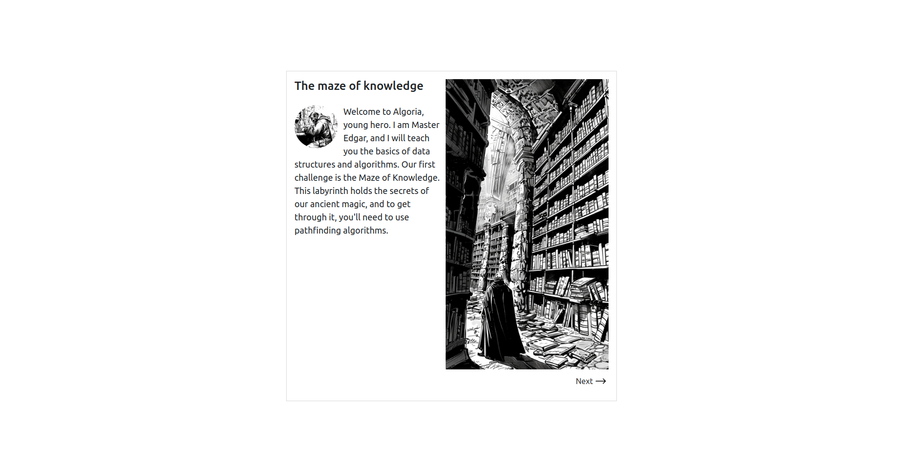
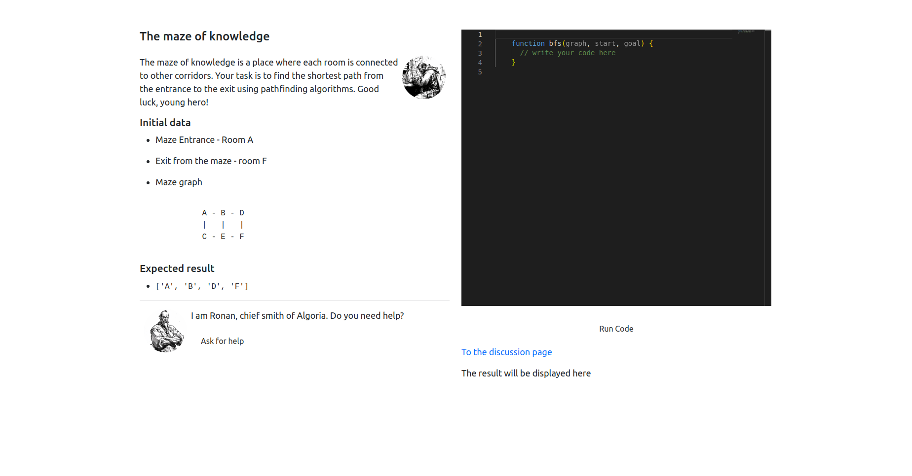

# Algoria
The algorithmic puzzle game.

## Table of Contents
- [Introduction](#introduction)
- [Stack](#stack)
- [v2 (remastering)](#remastering)
  - [Is it opened for contribution right now?](#is-it-opened-for-contribution-right-now)
- [Development server](#development-server)
- [Licensing](#licensing)

## Introduction
Algorithmic puzzle game is an adventure game where the player needs to solve puzzles and complete tasks using different data structures and algorithms.

The homepage: https://algoria.chm.org.ua

The player needs to save the kingdom from invaders, traveling through the fantasy world and facing various obstacles.

## Stack

The app is a browser-based adventure game built with a modern Angular (v18) + TypeScript (v5.4) front-end. It relies on Angular CLI for development and production builds, leverages RxJS for reactive data flows, and runs in a zoneless execution context.  

Key helpers include Monaco Editor for in-browser code editing, ngx-translate for client-side i18n, and a pair of domain-specific packages (`algoria-runner` and `algoria-utils`) that supply challenge execution and shared types. Testing is handled with Karma + Jasmine, and everything is managed through the usual Node/npm toolchain.

## v2 (remastering)
Algoria v1 had a goal — to become an exercise machine that contains all the common challenges (one needed to know before going to a technical interview) in a form of a game. With a time it became clear that it may bring even more benefit - to give newcomers their first real-world experience, and show employers a proof in a form of a trail of contribution to an open source project. Given that, it became clear that the app needs refactoring.    

> The current state of v2 can be reviewed at the `remastering` branch.

Thus, Algoria v2 comes with breaking changes to the app architecture. This changes impact almost all parts of the app:

- **Challenges and their expected results** — now maintained in the [separate repository](https://github.com/chm-org/algoria-challenges), the app loads the challenges and renders them, so if any challenge needs to be updated it is possible to do without the app redeployment
- **New entities** — skill trees (already there) and other challenges types (later) are coming in v2.
- **Shared types and JSON schemas** — to simplify entities' validation and creation process each entity now follows a corresponding schema. All shared types are maintained in the separate [repository](https://github.com/chm-org/algoria-utils) and available in a form of an [npm package](https://www.npmjs.com/package/algoria-utils).
- **Game attributes** — more game attributes comes into the app in V2, including the world map, and skills trees.

Watch this repository to stay updated!

### Is it opened for contribution right now?
Not yet. V2 is implemented in an "Assembly first" pattern, meaning that the application's core logic and structure are designed and built before focusing on the user interface or specific features. Given that, the next things need to be done before receiving the first contributions:

- **UI designs** — core UI elements are known, as well as pages and its components, now we need Figma designs to make the app user-friendly
- **Common Linter and prettier rules** — to avoid holly wars and make the code base consistent we need to set up this first
- **Essential documentation, files and issues** — to make the code developer friendly 

## Licensing

Released under **Creative Commons BY-NC-SA 4.0**.  
Commercial use is **not** permitted without the author’s explicit consent.
